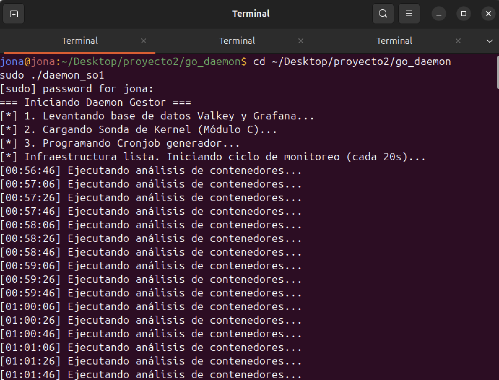
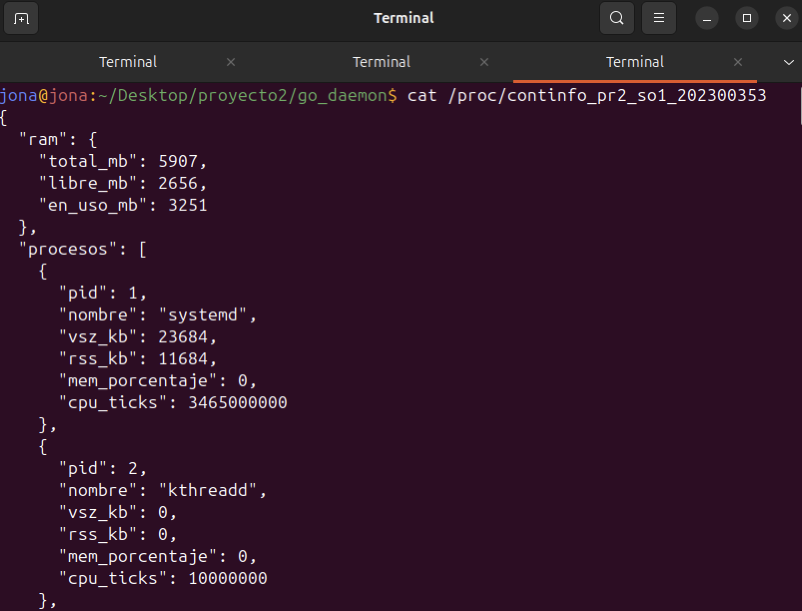
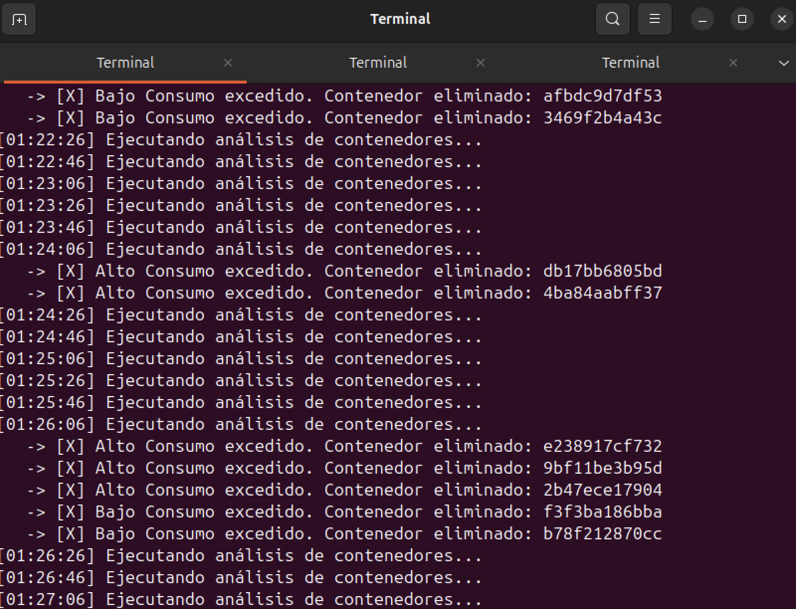
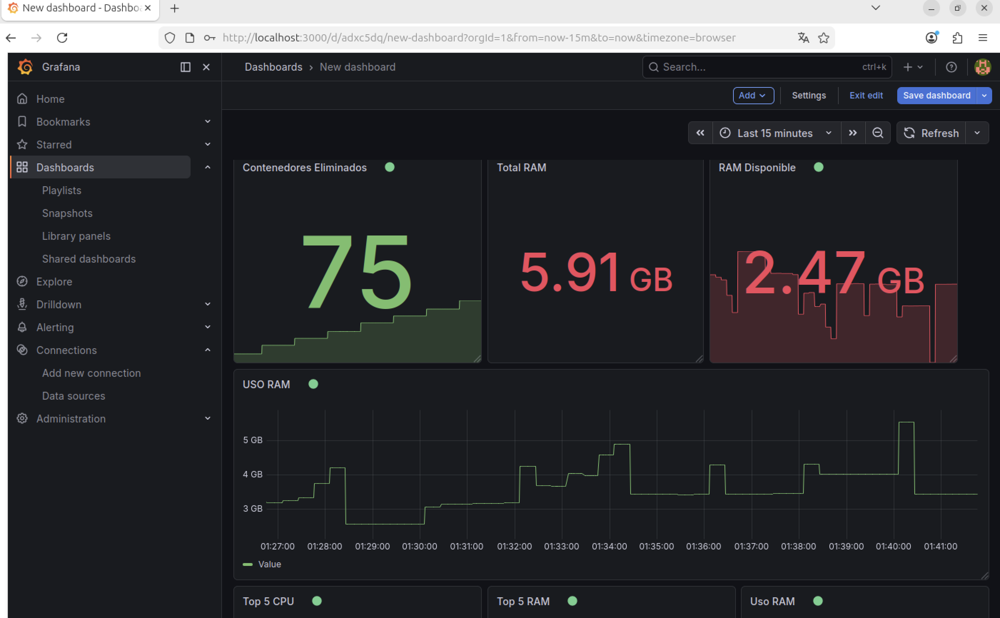
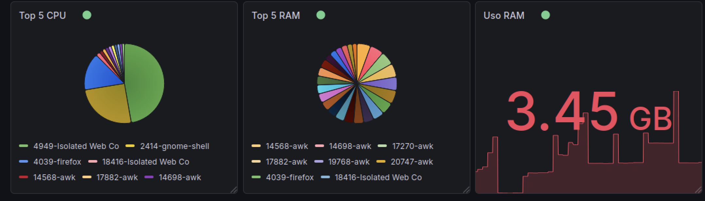
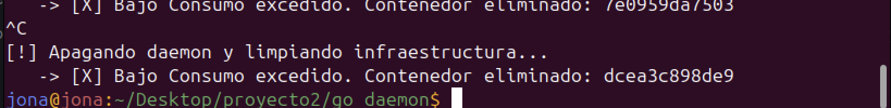

# Manual Técnico — Proyecto 2
**Sistemas Operativos 1 | Universidad San Carlos de Guatemala**

> **Estudiante:** Jonathan Eliud Jerónimo Salguero
> **Carnet:** 202300353
> **Curso:** Sistemas Operativos 1 — 1S2026

---

## Tabla de Contenidos

1. [Descripción General](#1-descripción-general)
2. [Arquitectura del Sistema](#2-arquitectura-del-sistema)
3. [Requisitos Previos](#3-requisitos-previos)
4. [Estructura del Repositorio](#4-estructura-del-repositorio)
5. [Guía de Ejecución Automatizada](#5-guía-de-ejecución-automatizada)
6. [Verificación y Evidencias (Pruebas)](#6-verificación-y-evidencias-pruebas)
7. [Lógica de Gestión de Contenedores](#7-lógica-de-gestión-de-contenedores)
8. [Dashboard en Grafana](#8-dashboard-en-grafana)
9. [Manejo de Errores y Apagado Seguro](#9-manejo-de-errores-y-apagado-seguro)
10. [Notas de Compatibilidad (ARM64)](#10-notas-de-compatibilidad-arm64)

---

## 1. Descripción General

Este proyecto implementa un sistema integral para la **monitorización proactiva, análisis automatizado y gestión inteligente de contenedores** en entornos Linux.

El sistema combina programación a **bajo nivel** (módulo de kernel en C) con **alto nivel** (Daemon en Go), resolviendo un problema real: la monitorización y estabilización autónoma de contenedores Docker sin intervención humana.

### Componentes principales

| Componente | Tecnología | Rol |
|---|---|---|
| Módulo de Kernel | C | Sensor de métricas del sistema desde el espacio del kernel. |
| Daemon | Go | Cerebro del sistema: automatiza el inicio, lee datos, decide y actúa. |
| Generador de carga | Bash + Cron | Simula creación de contenedores de prueba cada 2 minutos. |
| Base de datos | Valkey (Redis) | Almacenamiento rápido en memoria de métricas y logs. |
| Dashboard | Grafana | Visualización del ecosistema en tiempo real con persistencia de datos. |

---

## 2. Arquitectura del Sistema

El sistema fue diseñado con un enfoque de despliegue automatizado. El Daemon de Go actúa como orquestador principal.

```text
┌─────────────────────────────────────────────────────────┐
│                  DAEMON GESTIONADOR (Go)                │
│                                                         │
│  [FASE DE INICIO AUTOMÁTICO]                            │
│  1. Levanta Valkey y Grafana (Docker Compose)           │
│  2. Compila e inserta Módulo C (insmod)                 │
│  3. Programa Cronjob generador en el sistema            │
│                                                         │
│  [LOOP DE MONITOREO - Cada 20s]                         │
│     ├── Lee /proc/continfo_pr2_so1_202300353            │
│     ├── Parsea JSON a Estructuras Seguras               │
│     ├── Elimina contenedores excedentes (Docker API)    │
│     └── Escribe métricas y Top 5 en Valkey              │
└──────────────────────┬──────────────────────────────────┘
                       │
       ┌───────────────┼──────────────────────┐
       ▼               ▼                      ▼
┌─────────────┐ ┌─────────────┐      ┌──────────────────┐
│   KERNEL    │ │   CRONJOB   │      │  VALKEY + GRAFANA│
│  MODULE (C) │ │  (Bash)     │      │  (Docker Compose)│
│             │ │             │      │                  │
│ task_struct │ │ Cada 2 min  │      │ Dashboard:       │
│ → /proc/    │ │ crea 5      │      │ - RAM total/libre│
│ continfo_   │ │ contenedores│      │ - Top 5 CPU/RAM  │
│ pr2_so1_    │ │ aleatorios  │      │ - Eliminados     │
└─────────────┘ └─────────────┘      └──────────────────┘
````

-----

## 3\. Requisitos Previos

### Sistema Operativo

  - Ubuntu Server (arquitectura ARM64 o x86\_64).
  - Kernel Linux con soporte para módulos cargables (`CONFIG_MODULES=y`).

### Dependencias del sistema

Asegúrese de contar con las siguientes herramientas antes de la ejecución:

```bash
# Compiladores de C y cabeceras del kernel actual
sudo apt update
sudo apt install -y build-essential linux-headers-$(uname -r)

# Entorno Go
sudo apt install -y golang-go

# Ecosistema Docker
sudo apt install -y docker.io docker-compose-v2
```

-----

## 4\. Estructura del Repositorio

```text
proyecto2/
├── kernel_module/
│   ├── modulo.c          # Código fuente de la Sonda en C
│   └── Makefile          # Script de compilación (Kbuild)
├── cronjob/
│   └── generador.sh      # Generador de carga Alpine/AWK
├── go_daemon/
│   ├── main.go           # Daemon orquestador principal
│   └── go.mod            # Módulos ([github.com/redis/go-redis/v9](https://github.com/redis/go-redis/v9))
└── db/
    └── docker-compose.yml # Infraestructura con Volúmenes Persistentes
```

-----

## 5\. Guía de Ejecución Automatizada

El sistema ha sido diseñado para ejecutarse mediante un único punto de entrada (el Daemon en Go), el cual se encarga de preparar todo el entorno operativo.

**Paso 1: Preparar la Sonda (Compilación del Kernel)**
Antes de arrancar el cerebro, el módulo debe estar compilado para su versión de Kernel.

```bash
cd ~/Desktop/proyecto2/kernel_module
make clean
make
```

**Paso 2: Arrancar el Sistema Maestro (Daemon Go)**
El Daemon requiere permisos de superusuario para interactuar con Docker y cargar el módulo del kernel.

```bash
cd ~/Desktop/proyecto2/go_daemon
go build -o daemon_so1 main.go
sudo ./daemon_so1
```



**Paso 3: Acceso al Dashboard**
Ingresar desde el navegador web a `http://<IP_DE_LA_MAQUINA>:3000`. La conexión con la base de datos y la creación del panel ya se encuentran persistidas mediante Volúmenes de Docker.

-----

## 6\. Verificación y Evidencias (Pruebas)

### 6.1 Interfaz `/proc` y Estructura JSON

El módulo C expone en tiempo real las métricas extraídas iterando sobre `task_struct`.

```bash
cat /proc/continfo_pr2_so1_202300353
```



**Estructura esperada:**

```json
{
  "ram": {
    "total_mb": 7935,
    "libre_mb": 112,
    "en_uso_mb": 7823
  },
  "procesos": [
    {
      "pid": 14568,
      "nombre": "awk",
      "vsz_kb": 591604,
      "rss_kb": 590720,
      "mem_porcentaje": 9,
      "cpu_ticks": 8131000000
    }
  ]
}
```

### 6.2 Lógica de Regulación en Tiempo Real

Cuando el Cronjob inyecta los 5 contenedores cada 2 minutos, el Daemon detecta el exceso en su ciclo de 20 segundos y aplica la limpieza.



-----

## 7\. Lógica de Gestión de Contenedores

El Daemon aplica reglas de negocio estrictas interactuando con la API de Docker mediante `exec.Command`.

### Restricciones Invariantes

| Regla | Condición de Cumplimiento |
|---|---|
| Contenedores Bajo Consumo | Siempre se mantienen exactamente **3** vivos. |
| Contenedores Alto Consumo | Siempre se mantienen exactamente **2** vivos. |
| Infraestructura Base | Grafana y Valkey están excluidos del algoritmo de eliminación. |

### Criterios de Selección (Top 5)

Para alimentar el Dashboard, el Daemon de Go ordena el arreglo de procesos extraído del Kernel utilizando la función `sort.Slice` nativa:

1.  **Top 5 RAM:** Ordenado de forma descendente basándose en la Memoria Física Residente (`RssKb`).
2.  **Top 5 CPU:** Ordenado de forma descendente basándose en los Ticks de CPU (`CpuTicks` = `utime` + `stime`).

-----

## 8\. Dashboard en Grafana




El panel consume los datos enviados por Go a Valkey mediante los siguientes comandos:

  * **Tarjetas:** Lectura directa con comando `GET` a llaves simples (`sys_ram_total`, `sys_contenedores_eliminados`).
  * **Series de Tiempo:** Monitoreo histórico del `GET sys_ram_uso`.
  * **Gráficos de Pastel:** Uso del comando Hash `HGETALL` sobre las llaves `top5_ram` y `top5_cpu`.

-----

## 9\. Manejo de Errores y Apagado Seguro

El sistema fue programado para evitar "fugas de recursos" (procesos huérfanos) mediante el manejo de señales del sistema operativo (`SIGTERM`, `SIGINT` mediante canales de Go).

**Procedimiento de Apagado Correcto:**

1.  En la terminal del Daemon Go, presionar **`Ctrl + C`**.
2.  El sistema intercepta la señal y ejecuta automáticamente la función `limpiarInfraestructura()`.
3.  Se remueve la entrada de `generador.sh` del Crontab.
4.  Se descarga el módulo C del Kernel (`rmmod`).



**(Opcional) Liberar puertos e infraestructura base:**

```bash
cd ~/Desktop/proyecto2/db
sudo docker compose down
```

*Nota: El Dashboard de Grafana no se perderá al ejecutar este comando, ya que se implementaron `volumes` en Docker para garantizar la persistencia.*

-----

## 10\. Notas de Compatibilidad (ARM64)

El enunciado del proyecto sugiere el uso de la imagen `roldyoran/go-client` para simular el perfil de "Alto Consumo" de memoria RAM. Sin embargo, el entorno de desarrollo y la máquina virtual actual se ejecutan sobre un procesador Apple Silicon M2 (arquitectura ARM64 / aarch64). Al intentar desplegar dicha imagen, se presentaban fallos de ejecución (salida silenciosa del contenedor) debido a que fue compilada exclusivamente para arquitecturas tradicionales `amd64` (Intel/AMD).

Para resolver esta limitación de hardware sin comprometer el rendimiento con emuladores como Rosetta, se adaptó el script generador (`generador.sh`) para utilizar la imagen oficial de `alpine`, la cual cuenta con soporte nativo para ARM64.

Para lograr el mismo perfil de alto consumo de RAM requerido por la rúbrica, se implementó un comando interno utilizando `awk` que inunda un arreglo en memoria, logrando simular el estrés necesario de forma 100% nativa y estable:

```bash
docker run -d alpine awk 'BEGIN {for(i=0;i<5000000;i++) a[i]="SO1_PROYECTO2_RAM_TEST_STRING_FILL"; system("sleep 240")}'
```


Comando para revisar los procesos cada 2 segundos
```bash
watch -n 2 'docker ps --format "table {{.ID}}\t{{.Names}}\t{{.Command}}"'
```