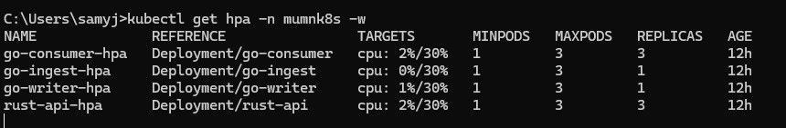
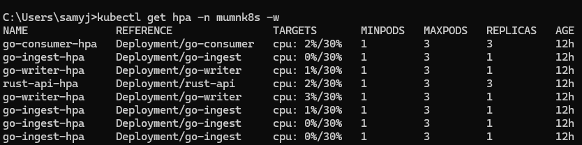
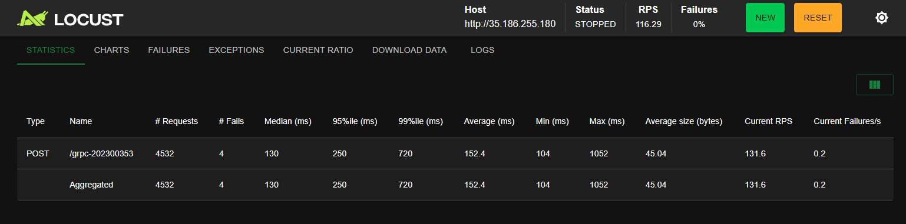
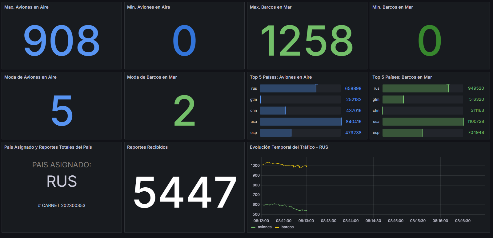
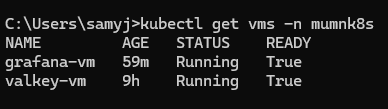

# Manual Técnico - M.U.M.N.K8s (Monitorización Unificada de Misiones Nacionales en K8s)

**Curso:** Laboratorio de Sistemas Operativos 1  
**Estudiante:** Jonathan Jeronimo 
**Carnet:** 202300353  
**Asignación de País:** RUS (Rusia)  

---

## 1. Introducción y Arquitectura del Sistema

El sistema M.U.M.N.K8s es una arquitectura nativa de la nube, distribuida y altamente escalable, desplegada sobre **Google Kubernetes Engine (GKE)**. Su objetivo es recolectar, procesar y visualizar en tiempo real grandes volúmenes de telemetría militar (aeronaves y embarcaciones) usando Locust como generador de tráfico masivo.

### Flujo de Datos
1. **Ingesta (Locust):** Genera tráfico HTTP masivo hacia el Gateway API de Kubernetes.
2. **API Gateway (Rust):** Actúa como el punto de entrada de alto rendimiento. Valida el tráfico y lo redirige internamente usando gRPC.
3. **Microservicios (Go):** 
   - *Go Ingest:* Interfaz gRPC que recibe la solicitud.
   - *Go Writer:* Publica el mensaje de manera asíncrona hacia el Message Broker.
4. **Message Broker (RabbitMQ):** Cola de mensajería (Pub/Sub) que amortigua picos de tráfico extremo, garantizando que no se pierdan datos.
5. **Worker (Go Consumer):** Consume datos de RabbitMQ y procesa las agregaciones matemáticas en tiempo real (máximos, mínimos, modas, series temporales).
6. **Persistencia (Valkey):** Almacenamiento rápido en memoria estructurada (Hashes, Streams) desplegado mediante **KubeVirt**.
7. **Visualización (Grafana):** Servidor de monitoreo también ejecutado mediante **KubeVirt**, conectado a Valkey para observar los datos en vivo.

---

## 2. Decisiones de Diseño y Justificaciones Tecnológicas

El diseño de la arquitectura fue planificado rigurosamente para prevenir cuellos de botella ("bottlenecks") bajo estrés constante. A continuación se detallan las decisiones tecnológicas clave adoptadas para el proyecto:

### 2.1 Rust como Gateway de Alto Rendimiento
* **Connection Pooling:** Se utilizó el framework Actix-Web con Connection Pooling nativo (`reqwest::Client`) en lugar de instanciar un cliente HTTP nuevo por cada petición. Esto resolvió problemas críticos de saturación de sockets TCP ("socket exhaustion") y latencia alta que generaban errores HTTP 503 bajo alta carga.
* **Seguridad de Memoria:** Al utilizar Rust, garantizamos que el punto de entrada de la aplicación esté libre de fugas de memoria (Memory Leaks), algo fundamental cuando se reciben cientos de requests por segundo.

### 2.2 Go (Golang) para Procesamiento Asíncrono
* **Eficiencia de Goroutines:** La naturaleza de las goroutines de Golang y su bajo consumo de recursos (3-6 MiB de RAM por pod) permitió procesar de manera ultra-eficiente la deserialización de mensajes binarios Protobuf y la comunicación con el Message Broker.
* **Agregación Matemática en Tiempo Real (Consumer):** En lugar de saturar Grafana leyendo cientos de miles de textos en crudo, el *Go Consumer* fue rediseñado con algoritmos O(1). Mantiene y actualiza al vuelo métricas complejas (Top 5, Modas, Máximos y Mínimos) e inserta datos ordenados cronológicamente en *Redis Streams* (XADD), permitiendo visualizaciones en tiempo real ultra rápidas.

### 2.3 RabbitMQ como Amortiguador (Message Broker)
El uso de un sistema de colas (Pub/Sub) separa el proceso de ingesta del proceso de escritura en base de datos. Si el sistema de base de datos se ralentiza temporalmente, los mensajes quedan seguros en la cola `wartweets` de RabbitMQ, evitando pérdida de telemetría y dando tiempo a que Kubernetes asigne más réplicas de procesamiento.

### 2.4 KubeVirt en GKE Free-Tier
* **Virtualización Nativa en K8s:** Al carecer de virtualización por hardware (KVM anidado) en los nodos gratuitos de GKE, las VMs (`grafana-vm` y `valkey-vm`) funcionaban bajo emulación por software (QEMU). Se optimizaron meticulosamente las cuotas de RAM de las VMs (256Mi - 512Mi) para evitar el estrangulamiento (*OOMKilled*) del nodo único y permitir que los servicios mantuvieran estabilidad sin agotar la memoria del clúster.

### 2.5 Registro Privado con Zot OCI
Se provisionó una máquina virtual externa a Kubernetes dedicada exclusivamente a operar como un registro OCI usando **Zot**. Todas las imágenes Docker de los microservicios fueron tageadas y pusheadas hacia esta instancia, demostrando separación de entornos (Build/Registry vs Runtime/Cluster) y buenas prácticas DevSecOps.

---

## 3. Instrucciones de Despliegue

La infraestructura se encuentra completamente automatizada en manifiestos YAML y contenedores de Docker alojados en un registro remoto privado gestionado con **Zot**.

### Pasos de Configuración:
1. **Registro de Imágenes (Zot):**
   Las imágenes (`rust-api`, `go-ingest`, `go-writer`, `go-consumer`) se compilan y publican en una VM en GCP.
   ```bash
   docker build -t 35.238.80.248:5000/<servicio>:latest .
   docker push 35.238.80.248:5000/<servicio>:latest
   ```
2. **Despliegue del Clúster en GKE:**
   Se aplican los manifiestos base que incluyen el Gateway API, HPA, Secretos y Deployments de los servicios.
   ```bash
   kubectl apply -f k8s/api/
   ```
3. **Despliegue de RabbitMQ:**
   ```bash
   kubectl apply -f k8s/base/rabbitmq.yaml
   ```
4. **Despliegue de KubeVirt (Valkey y Grafana):**
   Se aplican las definiciones de `VirtualMachine` basadas en la imagen contenedorizada de Ubuntu.
   ```bash
   kubectl apply -f k8s/kubevirt/
   ```

---

## 4. Generación de Carga y Comportamiento del Tráfico (Locust)

Se utilizó Locust para someter la arquitectura a pruebas de resistencia. Para evitar generar gráficas caóticas y poco realistas, se implementó un **algoritmo matemático de Caminata Aleatoria (Random Walk)** en el `locustfile.py`. Este algoritmo asigna un estado base de vehículos por país y le suma fluctuaciones controladas (e.g. entre -5 y +5) en cada iteración. Esto garantizó que la telemetría enviada por los radares simulara comportamientos marítimos y aéreos lógicos y fluidos a lo largo del tiempo.

### Configuración del HPA:
El *Horizontal Pod Autoscaler* de la API de Rust se configuró al **30% de uso de CPU**. Durante la prueba de Locust, se observó que el tráfico generaba picos de CPU, lo que obligaba a GKE a provisionar nuevas réplicas dinámicamente, asegurando una latencia baja (0% de fallos).




### Análisis Comparativo (Go Writers y Valkey):
Se realizaron pruebas contrastando 1 réplica vs 2 réplicas de los procesos asíncronos (`go-writer` y consumidores):

1. **Con 1 Réplica:** RabbitMQ mostraba una pequeña cola de acumulación temporal durante los picos máximos de carga. Valkey procesaba las escrituras a un ritmo sostenido pero el único nodo en la red experimentaba alto overhead de red.
2. **Con 2 Réplicas:** El rendimiento del clúster mejoró dramáticamente. La concurrencia paralela permitió que la cola de RabbitMQ permaneciera cercana a cero en todo momento, garantizando que el almacenamiento final en Valkey y la actualización en Grafana fuera estrictamente en tiempo real, validando la ventaja del procesamiento distribuido.



---

## 5. Visualización y Monitorización (Grafana)

Los resultados se visualizan de manera estructurada con actualización en vivo.

**Elementos Integrados:**
- **Estadísticas Históricas:** Máximos y Mínimos generales calculados por Go de manera progresiva.
- **Top 5 Países:** Barras horizontales extraídas con `HGETALL`.
- **Moda:** Frecuencia máxima procesada y almacenada bajo demanda para alta eficiencia en la consulta.
- **Evolución Temporal:** La telemetría del país asignado (RUS) fue almacenada usando la instrucción de `Streams` (`XADD`) en Valkey, permitiendo a Grafana desplegar una visualización multi-línea con interpolación suave (`smooth`) y sin errores de parseo de JSON.





---

## 6. Conclusiones
1. La implementación de API Gateway en Rust combinada con procesamiento asíncrono en Go proporciona un soporte excepcional para tráfico masivo sin sacrificar los recursos limitados del nodo.
2. Trasladar la carga computacional (agrupaciones y modas) al backend (Consumidor de Go) en lugar de hacerlo en Grafana previene caídas en el motor de visualización cuando se manejan cientos de miles de registros.
3. KubeVirt demostró ser una herramienta muy poderosa para gestionar cargas mixtas (VMs y Contenedores) en el mismo clúster, sin embargo, requiere hardware con soporte KVM habilitado para evitar la severa penalización de emulación por software que sufrimos en los entornos Free-Tier.